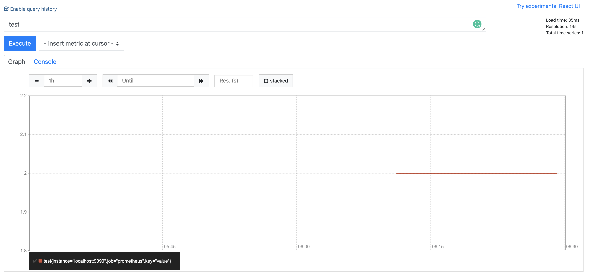

# backfiller

A practice-purposed cli tool to do retroactive recording rule evaluation for Prometheus.

Aims to fix issue https://github.com/prometheus/prometheus/issues/11.

## Build

`
GO111MODULE=on go build -o backfiller main.go
`

## How to use

```
➜  backfiller -h
usage: backfiller [<flags>] <rule-file> [<db path>] [<dest path>]

Tooling for backfilling Prometheus Recording Rules.

Flags:
  -h, --help                  Show context-sensitive help (also try --help-long and --help-man).
      --version               Show application version.
      --max-samples=50000000  Maximum number of samples a single query can load into memory. Note that queries will fail if they try to load more
                              samples than this into memory, so this also limits the number of samples a query can return.
      --timeout=2m            Maximum time a query may take before being aborted.
      --start=START           Start time (RFC3339 or Unix timestamp).
      --end=END               End time (RFC3339 or Unix timestamp).
      --eval-interval=30s     How frequently to evaluate the recording rules.
      --max-samples-in-mem=10000  
                              maximum number of samples to process in a cycle.
      --query-log-file=""     File to which PromQL queries are logged.
      --log.level=info        Only log messages with the given severity or above. One of: [debug, info, warn, error]
      --log.format=logfmt     Output format of log messages. One of: [logfmt, json]

Args:
  <rule-file>    The rule file for backfilling.
  [<db path>]    tsdb path (default is data/)
  [<dest path>]  path to generate new block (default is data/)

```

## Tutorial

Start Prometheus in the local environment. It is important to add a flag `--storage.tsdb.allow-overlapping-blocks` to allow overlapping block during tsdb reload.

```
./prometheus --storage.tsdb.allow-overlapping-blocks
```


Use [tsdbcli](https://github.com/prometheus/prometheus/tree/master/tsdb/cmd/tsdb) to check the metrics in tsdb dir `data/`. There is no metric name containing `test`.

```
./tsdbcli dump data | grep test
```

Do backfilling based on rule file `example.yaml`. It will firstly validate the rule file and then loads its recording rules.

The first `data` arg specifies the tsdb dir to query the past data and the second one specifies the dir to generate the new block. 

```
./backfiller example.yaml data data
level=info msg="replaying WAL, this may take awhile"
level=info msg="WAL segment loaded" segment=0 maxSegment=1
level=info msg="WAL segment loaded" segment=1 maxSegment=1
level=info msg="write block" mint=1576563064320 maxt=1576563859000 ulid=01DW98EQVKD55FCJ0QJV2FTT0P duration=770.543238ms
blockId=data/01DW98EQVKD55FCJ0QJV2FTT0P
```

Check the metrics in the tsdb dir again.

```
./tsdbcli dump data | grep test | head
{__name__="test",instance="localhost:9090",job="prometheus",key="value"} 2 1576563069000
{__name__="test",instance="localhost:9090",job="prometheus",key="value"} 2 1576563074000
{__name__="test",instance="localhost:9090",job="prometheus",key="value"} 2 1576563079000
{__name__="test",instance="localhost:9090",job="prometheus",key="value"} 2 1576563084000
{__name__="test",instance="localhost:9090",job="prometheus",key="value"} 2 1576563089000
{__name__="test",instance="localhost:9090",job="prometheus",key="value"} 2 1576563094000
{__name__="test",instance="localhost:9090",job="prometheus",key="value"} 2 1576563099000
{__name__="test",instance="localhost:9090",job="prometheus",key="value"} 2 1576563104000
{__name__="test",instance="localhost:9090",job="prometheus",key="value"} 2 1576563109000
{__name__="test",instance="localhost:9090",job="prometheus",key="value"} 2 1576563114000
```

Since Prometheus will automatically merge the blocks in next compaction, we can see the generated data after the compaction, or simply restart Prometheus. 

Then we can check the results on the Web UI.

